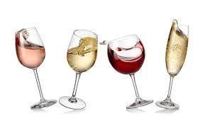
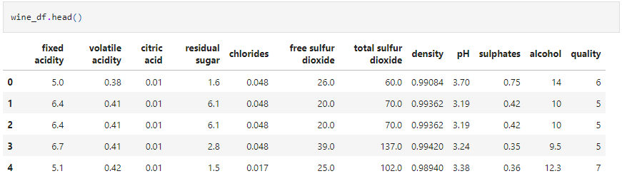
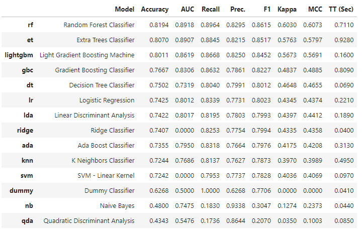
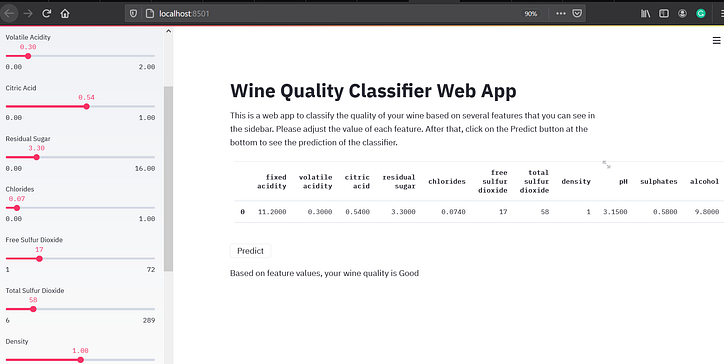

# PyCaret y Streamlit

Construyendo un clasificador de vinos con PyCaret y usando Streamlit para crear e implementar la aplicación web

La creación e implementación de un modelo de aprendizaje automático nunca ha sido tan fácil. En este momento, tenemos muchos marcos y bibliotecas que nos permiten crear modelos de aprendizaje automático con solo unas pocas líneas de código. Entre todos ellos, PyCaret es uno de los mejores. Para crear e implementar una aplicación web para nuestro proyecto de ciencia de datos, Streamlit se ha vuelto muy popular últimamente.

En este artículo, utilizaremos estas dos bibliotecas para crear una aplicación web de ciencia de datos. Usaremos PyCaret para construir un clasificador de calidad de vino. A continuación, usaremos Streamlit para crear e implementar este clasificador de vinos. Se sorprenderá de lo fácil y rápido que es construir el clasificador e implementar la aplicación web con estas dos bibliotecas. ¡Entonces empecemos!

# Introducción a la aplicación a desarrollar.

Como hemos comentado, el objetivo de este articulo es crear un modelo de aprendizaje automático usando Pycaret y Streamlit. Para ello vamos a estructurar el proyecto de la siguiente manera:

- Cargar y procesar los datos
- Construir el modelo de clasificador usando Pycaret.
- Crear la aplicación wweb con Streamlit

# Cargar y procesar los datos

Los datos que usaremos en este artículo son el conjunto de datos de calidad del vino. Este conjunto de datos consta de 1599 instancias con 12 características. Carguemos el conjunto de datos con Pandas.

Como se puede ver arriba, tenemos diferentes características tales como fixed acidity, citric acid, pH, y así sucesivamente. La tarea de nuestro clasificador es predecir si la calidad del vino es buena o mala. Sin embargo, los valores de la qualitycaracterística no son los que esperábamos. Necesitamos transformar el valor de esta función para que sea "bueno" o "malo".

¡Ahora tenemos los datos que estamos buscando! Tenga en cuenta que también puede comprobar que hay 855 vinos clasificados como "buenos" y 744 vinos clasificados como "malos". Esta proporción parece bastante equilibrada y es seguro decir que no tenemos un problema de conjunto de datos desequilibrado.

El conjunto de datos también está limpio, lo que significa que no hay ningún valor perdido, ningún valor duplicado y los tipos de datos son todos correctos.

# Construir modelo de clasificador usando PyCaret

PyCaret es una biblioteca de aprendizaje automático de código bajo que automatiza todos los flujos de trabajo de aprendizaje automático. Lo que hace es que proporciona un contenedor para bibliotecas populares de aprendizaje automático como scikit-learn, XGBoost, LightGBM, CatBoost y muchas más.

Con PyCaret, básicamente podemos construir nuestro modelo de aprendizaje automático para clasificación, regresión, agrupamiento, detección de anomalías o problemas de PNL en solo unas pocas líneas de código.

# Cree la aplicación web con Streamlit
Ahora es el momento de que creemos nuestra aplicación web para clasificar vinos. En esta publicación, usaremos Streamlit para crear la aplicación web, ya que es más amigable para principiantes que Flask. Además, no es necesario tener experiencia previa con HTML y CSS para utilizar Streamlit.

